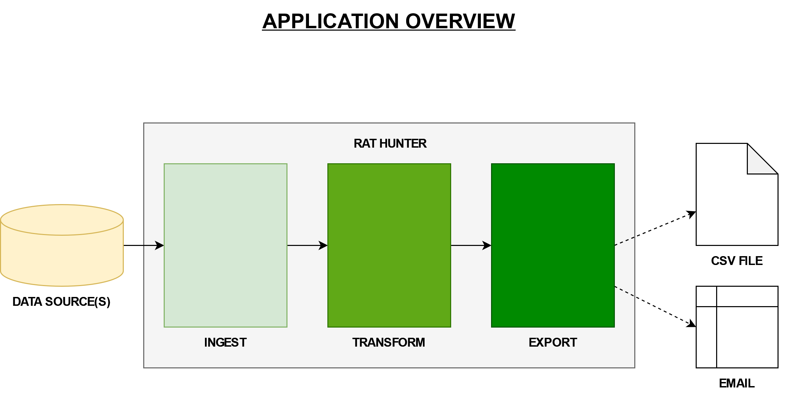
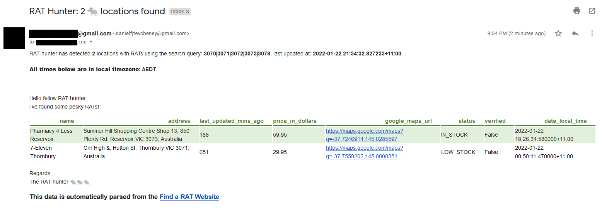
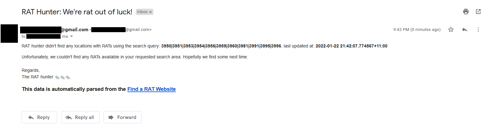

[](https://github.com/writememe/rat_hunter/actions/workflows/main.yml)
[](https://www.python.org/downloads/release/python-380/)
[](https://www.python.org/downloads/release/python-390/)
[](https://github.com/ambv/black)
[](http://mypy-lang.org/)


rat_hunter
=======

An automated tool to ingest, augment/transform and export Rapid Antigen Test (RAT) availability data. An overview diagram is shown below:



# Table of Contents

- [Terms of Use](#terms-of-use)
- [Installation](#installation)
- [Supported Environments](#basic-usage)
- [Example Usage](#example-usage)
- [Sample Screenshots](#sample-screenshots)
- [Project Structure](#project-structure)
- [Contributors](#contributors)

## Terms of Use

Before using this tool, please ensure you read the [Terms of Use](TERMS_OF_USE.md) and use responsibly.

## Installation

Follow the installation instructions below:

1. Create the virtual environment to run the application in:

```bash
virtualenv --python=`which python3` venv
source venv/bin/activate
```

2. Install the requirements file:

```python
pip install -r requirements.txt
```

## Supported Environments

This tool is supported in the following environments:

- Python 3.8 or 3.9
- Linux/Unix machines only

**NOTE: There are no specific packages that shouldn't work on a Windows machine, but this is not regularly tested, and thus not supported.**


## Example Usage

All examples are contained in the [examples](examples/) directory. In order to use those examples, please refer to this README inside the folder.

The following examples are available for use:

| Use Case | Description | File |
| ---------- | ------------ | ----------------- |
| Export to CSV file |Save all Victorian "in stock" RAT locations to a CSV file |[rat_hunter_to_csv_file.py](examples/rat_hunter_to_csv_file.py)|
| Export to email |Send a friendly HTML email using [yagmail](https://github.com/kootenpv/yagmail) to multiple recipients, based on their postcodes of interest |[rat_hunter_via_gmail.py](examples/rat_hunter_via_gmail.py)|


## Sample Screenshots

Using the example script which sends the [RAT results via gmail](examples/rat_hunter_via_gmail.py), below is a screenshot of the `rat_hunter` finding a result:



And if a result is not found, you can tailor `rat_hunter` to send an email as well:



## Project Structure

This tool and project uses some nomenclature, and has been designed in a way that scaling the features should be easy to achieve. Firstly, let's clarify the nomenclature used.

| Term | Description |
| ---------- | ------------ | 
| data source |A structured data source of RAT data, which can be supported by Pandas. Examples are: CSV, JSON, Excel file, HTML file.|
| [ingestors](rat_hunter/ingestors) |The class that ingests the data source, and converts it into a Pandas dataframe, for further operations. |
| [backend](rat_hunter/backend) |A location to store things like `.env` files for credentials, and possibly in future, database connectors. |
| [exporters](rat_hunter/exporters) |Exporting the Pandas dataframe of RAT results, such as export to CSV, or send an email. |
| [shared](rat_hunter/shared) |Central location to house centralised settings of functions which are used by other aspects to the tool. Examples are dataframe manipulation, output directories, datestamp manipulation |

### Design Decisions

Although ambitious, I wanted the tool be to able to extended by others, in ways that would add more functionality to suit their needs, but potentially still help others.

One example of this is the [`ingestors`](rat_hunter/ingestors/) folder structure:

```console
rat_hunter/ingestors
├── __init__.py
├── au
│   ├── __init__.py
│   └── findarat
│       ├── __init__.py
│       └── findarat.py
└── base
    ├── __init__.py
    └── base.py
```

Using this structure, we could end up with a second RAT data source for Australia, or add one for another country such as New Zealand. The code can be developed seperately without too much coupling on other ingestors. 

Similarly, with the [`exporters`](rat_hunter/exporters/) folder structure:

```console
rat_hunter/exporters
├── __init__.py
├── files.py
└── gmail.py
```

It would be great to see some people build a `slack` exporter, or perhaps a `twitter` exporter that people could utilise. So hopefully this gives you inspiration to give it a go :)

## Contributors

If you would like to contribute to this project, the best thing for now is to do the following:

- Look at the [open issues](https://github.com/writememe/rat_hunter/issues) to see if someone is working on it already, or there is an unassigned issue you might like to work on
- If not, please raise an issue, before doing any development yourself, so we can discuss and document the intent and approach.
- Once we've agreed, feel free to work on and submit your pull request. NOTE: You should be able to run [`make lint-all`](Makefile#L11) and not have any CI issues reported back to the console
- We will review it and approve it or provide feedback as suggested.